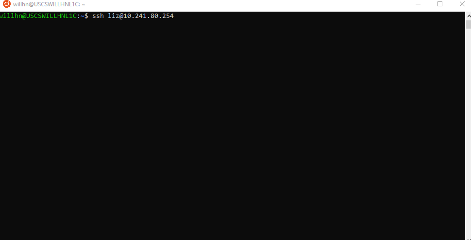
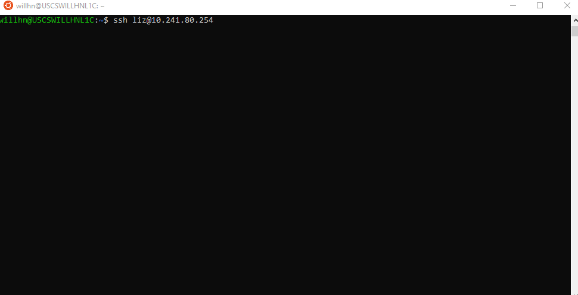
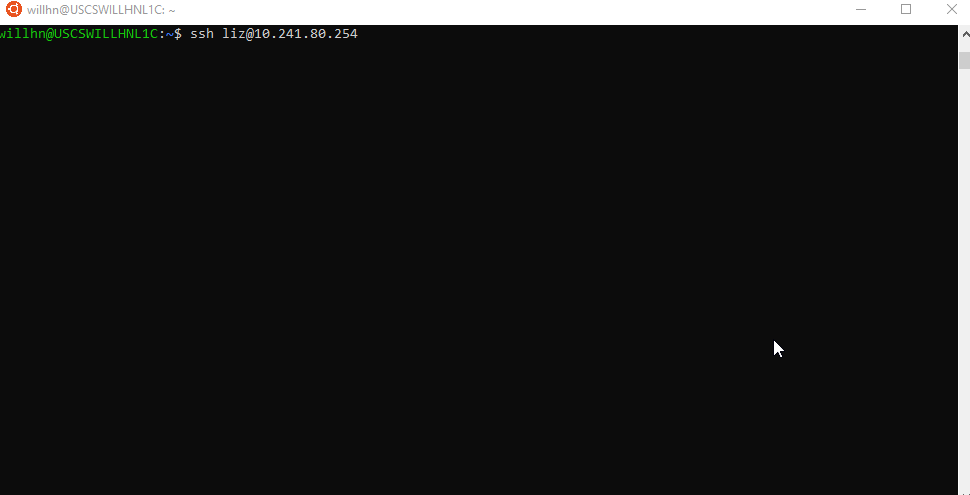

###############################
Container Shell config examples
###############################
Here are some example configs to show off some of the cool things you can do
with Container Shell!

To try/test the example, rename the ``INI`` file to simply ``/etc/container_shell/config.ini``
on your system.

All of the `GIFs <https://en.wikipedia.org/wiki/GIF>`_ are demonstrating the
use of Container Shell via the ```ForceCommand`` key in the
`sshd_config <https://linux.die.net/man/5/sshd_config>`_ file of a Ubuntu 18.04
host.

Basic
=====
The ``basic.config.ini`` example config simply drops a user into a CentOS 7
container.




Moderate
========
The ``moderate.config.ini`` introduces some Quality of Service options that
limits the user to a max of 2 CPUs of processing power. It also opts-out of the
*check for an updated container image* upon login feature, runs as the default
user defined within the container image, doesn't mask the hostname, and users
Google DNS servers instead of defaulting to the host's DNS settings.




Advanced
========
The ``advanced.config.ini`` leverages the ``command`` feature to drop users into
an `Python REPL <https://en.wikipedia.org/wiki/Read%E2%80%93eval%E2%80%93print_loop>`_
session instead of a standard Linux/Unix shell.

It will mount the ``/home`` of the host system inside the container. Finally the
specific user ``administrator``, ``admin``, or ``root`` logs in, they'll get a
normal shell instead of iPython.


